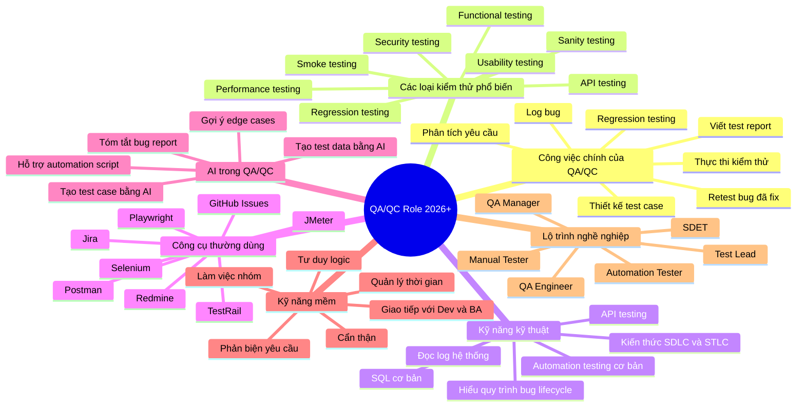

# Prompt Log – Mindmap

## Prompt M1-01 – Generate QA/QC Role Mindmap

**Thời gian:** 14:13 04/06/2026  
**Công cụ:** ChatGPT  
**Requirement:** G9.1 – QA/QC Role Mindmap  

## Prompt

Tôi đang làm bài Software Testing HW01.

Yêu cầu: tạo một QA/QC role mindmap cho thị trường QA/QC năm 2026+.

Hãy tạo mindmap về vai trò QA/QC trong ngành phần mềm, bao gồm các nhóm nội dung chính như:

- Công việc chính của QA/QC
- Các loại kiểm thử phổ biến
- Kỹ năng kỹ thuật
- Công cụ thường dùng
- AI trong QA/QC
- Kỹ năng mềm
- Lộ trình nghề nghiệp

Yêu cầu output:

- Trả về bằng Mermaid mindmap format.
- Chỉ trả về Mermaid code, không giải thích dài.
- Nội dung bằng tiếng Việt.
- Mindmap nên đủ rõ để tôi có thể render thành ảnh PNG.

## AI Output

## Student verification

Sau khi kiểm tra mindmap do AI tạo, tôi phát hiện 3 vấn đề:

1. AI chưa nhấn mạnh risk-based testing.
2. AI chưa tách rõ automation testing và AI-assisted testing.
3. AI chưa thể hiện đủ vai trò của domain knowledge.

Tôi đã sửa lại trong `mindmap/corrected_qaqc_mindmap.md` và giải thích chi tiết trong `mindmap/mindmap_ai_mistakes.md`.
