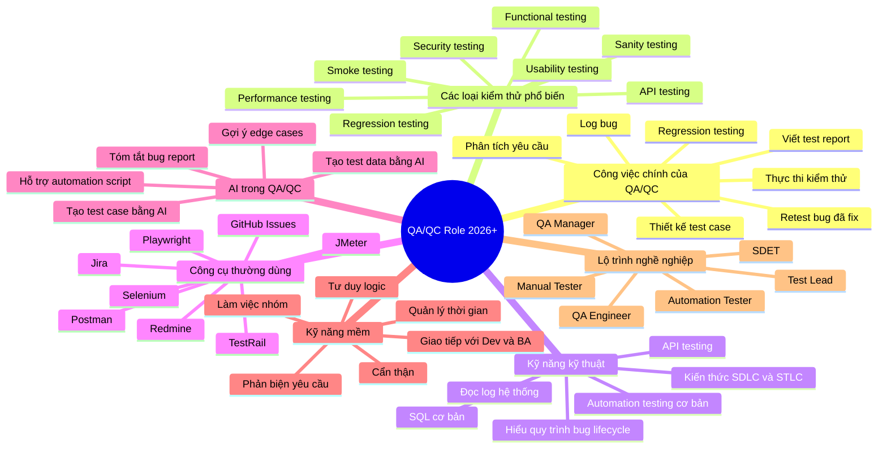

# AI-Generated QA/QC Role Mindmap

```mermaid
mindmap
  root((QA/QC Role 2026+))
    Công việc chính của QA/QC
      Phân tích yêu cầu
      Thiết kế test case
      Thực thi kiểm thử
      Log bug
      Retest bug đã fix
      Regression testing
      Viết test report
    Các loại kiểm thử phổ biến
      Functional testing
      Regression testing
      Smoke testing
      Sanity testing
      API testing
      Performance testing
      Security testing
      Usability testing
    Kỹ năng kỹ thuật
      SQL cơ bản
      API testing
      Đọc log hệ thống
      Kiến thức SDLC và STLC
      Hiểu quy trình bug lifecycle
      Automation testing cơ bản
    Công cụ thường dùng
      Jira
      Redmine
      Postman
      Selenium
      Playwright
      JMeter
      GitHub Issues
      TestRail
    AI trong QA/QC
      Tạo test case bằng AI
      Tạo test data bằng AI
      Tóm tắt bug report
      Gợi ý edge cases
      Hỗ trợ automation script
    Kỹ năng mềm
      Giao tiếp với Dev và BA
      Tư duy logic
      Cẩn thận
      Làm việc nhóm
      Phản biện yêu cầu
      Quản lý thời gian
    Lộ trình nghề nghiệp
      Manual Tester
      QA Engineer
      Automation Tester
      SDET
      Test Lead
      QA Manager
```
