# Requirement 1 – QA/QC Job Market 2026+

## 1. Danh sách chi tiết tin tuyển dụng

### Job 01 – Chuyên Viên Kiểm Thử Phần Mềm

**Công ty:** CÔNG TY CỔ PHẦN CÔNG NGHỆ AIT  
**Nền tảng:** TopCV  
**Ngày đăng / hạn:** Ngày đăng không hiển thị / hạn nộp hồ sơ: 21/06/2026  
**Địa điểm:** Số 1 Giang Văn Minh, phường Kim Mã, quận Ba Đình, Hà Nội  
**Thời gian làm việc:** Thứ 2 - Thứ 6, từ 08:00 đến 17:30  
**Lương:** 15–25 triệu VND / Up to 25M gross  
**Kinh nghiệm:** 2 năm  
**Học vấn:** Đại học trở lên  
**Chuyên môn:** Software Tester (Automation & Manual), IT - Phần mềm, Viễn thông, Bưu chính  
**Có liên quan AI / LLM / Automation-AI:** Không  
**Link:** [TopCV - Chuyên Viên Kiểm Thử Phần Mềm](https://www.topcv.vn/viec-lam/chuyen-vien-kiem-thu-phan-mem/2172054.html)

**Minh chứng ảnh chụp:**

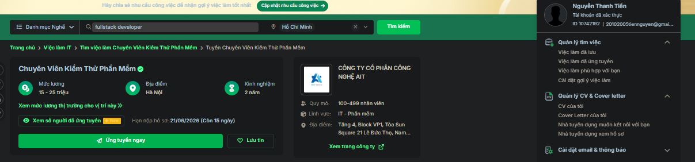

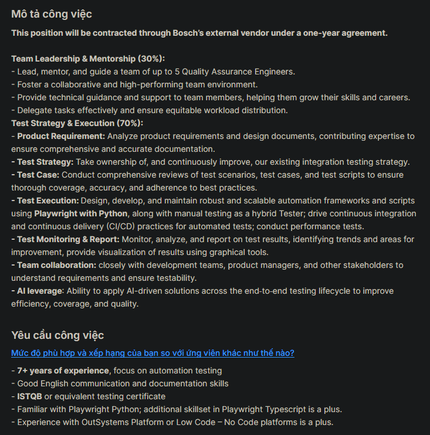

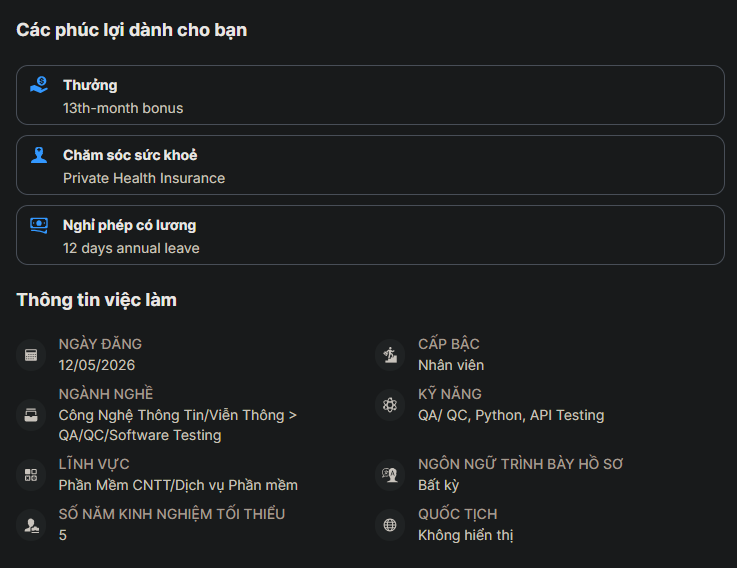
**Tóm tắt mô tả công việc:**
Vị trí Chuyên viên Kiểm thử Phần mềm phụ trách phân tích yêu cầu, phối hợp với BA làm rõ nghiệp vụ, xây dựng test plan, test case, test script và test data. Ứng viên thực hiện kiểm thử App/Web, kiểm tra lỗi, viết báo cáo test, đánh giá kết quả và phối hợp với Developer để đảm bảo chất lượng sản phẩm trong các dự án bưu chính, logistics, fintech và doanh nghiệp.

**Kỹ năng yêu cầu:**
Ứng viên tốt nghiệp đại học các ngành CNTT, Hệ thống thông tin, Điện tử viễn thông hoặc tương đương; có trên 1.5 năm kinh nghiệm kiểm thử phần mềm. Cần nắm vững quy trình, phương pháp và kỹ thuật test, có kinh nghiệm test App/Web, làm việc độc lập và có thể onsite theo dự án. SQL, API Testing và kinh nghiệm làm key member là lợi thế.

**Quyền lợi:**
Mức lương lên đến 25 triệu gross, có trợ cấp thiết bị cá nhân, đầy đủ BHXH, BHYT, BHTN, 12 ngày phép/năm, thưởng lễ Tết, lương tháng 13 và thưởng cuối năm. Công ty cung cấp thiết bị, đào tạo thường xuyên, xét tăng lương định kỳ, môi trường năng động, nhiều cơ hội thăng tiến, được làm việc với đối tác lớn và tham gia du lịch, teambuilding hằng năm.

**Phân tích tác động của AI:**
Tin tuyển dụng không đề cập trực tiếp đến AI hay AI-assisted testing. Tuy nhiên, AI có thể hỗ trợ tester trong việc tóm tắt yêu cầu, gợi ý test scenario, tạo test data, viết bug report nháp hoặc checklist. Dù vậy, tester vẫn giữ vai trò chính trong phân tích nghiệp vụ, thiết kế test, xác nhận lỗi và đánh giá chất lượng phần mềm.

---

### Job 02 – Software QA Engineer (AI-first mindset)

**Công ty:** Zen8Labs
**Nền tảng:** ITviec
**Ngày đăng:** Đăng ngày 29/05/2026
**Địa điểm:** TT03A-13, Mo Lao New Urban, Ha Dong, Ha Noi
**Lương:** Up to $2000
**Có liên quan AI / LLM / Automation-AI:** Có
**Link:** [ITviec - Software QA Engineer AI-first Mindset](https://itviec.com/it-jobs/qa?job_selected=software-qa-engineer-ai-first-mindset-zen8labs-5907)

**Minh chứng ảnh chụp:**

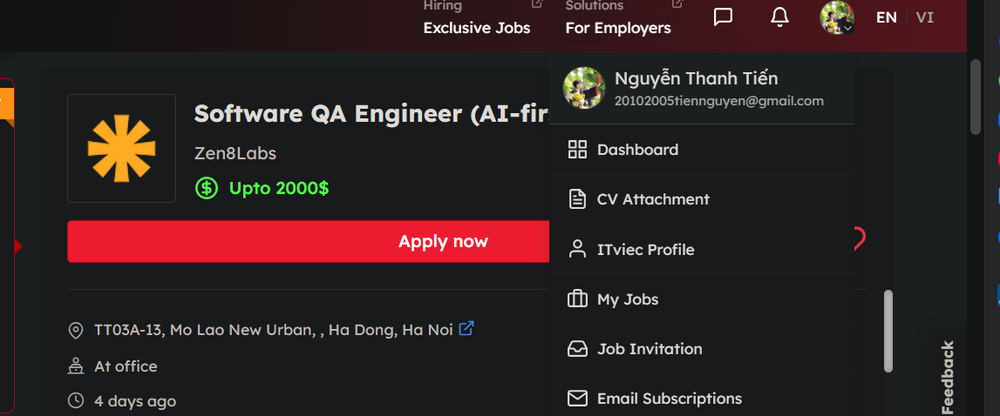

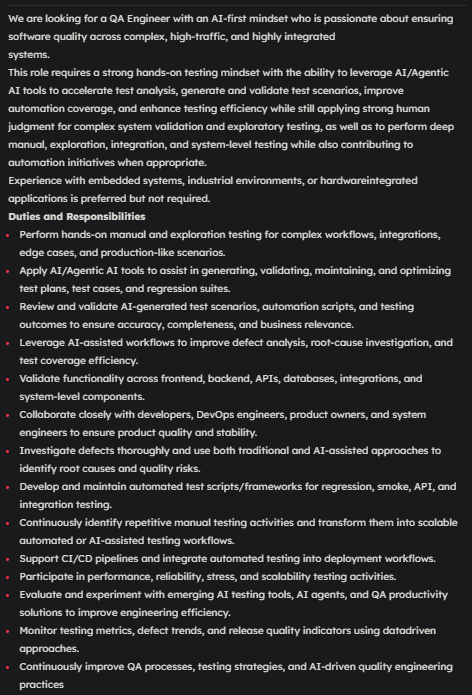

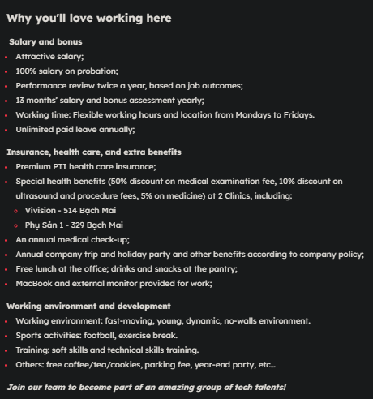

**Tóm tắt mô tả công việc:**
Vị trí này yêu cầu QA Engineer có tư duy AI-first, chịu trách nhiệm đảm bảo chất lượng cho các hệ thống phức tạp, có lưu lượng cao và tích hợp nhiều thành phần. Công việc bao gồm manual testing, exploratory testing, integration testing, system-level testing, API/backend validation, phát triển automation scripts/frameworks, hỗ trợ CI/CD và tham gia performance, reliability, stress, scalability testing. Điểm nổi bật là ứng viên phải biết áp dụng AI/Agentic AI tools để tạo, kiểm tra, duy trì và tối ưu test plan, test case, regression suites, automation scripts, defect analysis và root-cause investigation.

**Kỹ năng yêu cầu:**
AI/Agentic AI tools, AI/LLM, Cursor, Claude, GitHub Copilot, ChatGPT, Selenium, Playwright, Cypress, Robot Framework, JavaScript, Java, Python, API testing, CI/CD, Jira, qTest, Xray, TestRail.

**Phân tích tác động của AI:**
Tin tuyển dụng này thể hiện rõ xu hướng AI-first trong QA/QC. Tester không chỉ thực hiện manual testing và automation testing mà còn phải biết dùng AI/LLM/Agentic AI tools để tạo, kiểm tra, tối ưu test case, phân tích lỗi và cải thiện độ bao phủ kiểm thử; tuy nhiên, job cũng nhấn mạnh human judgment để kiểm tra tính đúng đắn, đầy đủ và phù hợp nghiệp vụ của output do AI tạo.

---

### Job 03 – Product Quality Assurance Quality Control

**Công ty:** Flowmingo AI  
**Nền tảng:** LinkedIn  
**Ngày đăng:** 1 tháng trước
**Địa điểm:** Thành phố Hồ Chí Minh
**Lương:** 25–35 triệu VND/month gross  
**Có liên quan AI / LLM / Automation-AI:** Có
**Link:** [LinkedIn - Product Quality Assurance Quality Control at Flowmingo AI](https://vn.linkedin.com/jobs/view/product-quality-assurance-quality-control-at-flowmingo-ai-4402341846)

**Minh chứng ảnh chụp:**

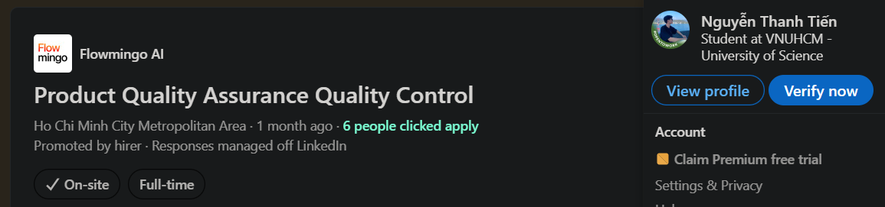

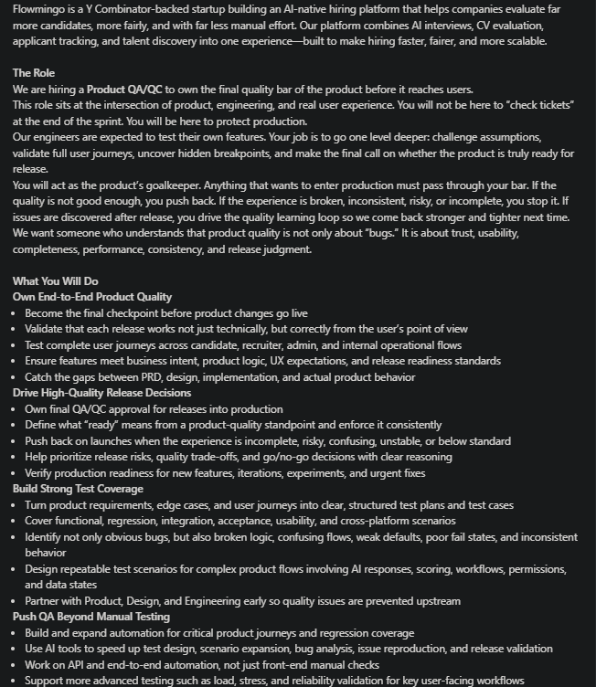

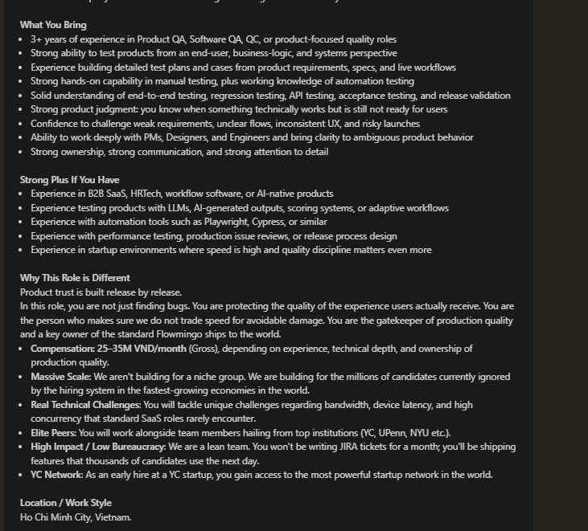

**Tóm tắt mô tả công việc:**
Vị trí Product QA/QC chịu trách nhiệm đảm bảo chất lượng sản phẩm trước khi phát hành. Tester cần kiểm thử toàn bộ hành trình người dùng cho candidate, recruiter, admin và internal flows; đánh giá business logic, UX, hiệu năng, tính nhất quán và mức độ sẵn sàng release. Công việc bao gồm xây dựng test plan, test case, kiểm thử functional, regression, integration, acceptance, usability, cross-platform và thiết kế scenario cho các luồng phức tạp liên quan đến AI responses, scoring, workflows, permissions và data states.

**Kỹ năng yêu cầu:**
Ứng viên cần có từ 3 năm kinh nghiệm Product QA, Software QA/QC hoặc vai trò chất lượng sản phẩm. Cần có khả năng kiểm thử từ góc nhìn người dùng cuối, business logic và hệ thống; có kinh nghiệm manual testing, hiểu automation, E2E testing, regression, API testing, acceptance testing và release validation. Kinh nghiệm với B2B SaaS, HRTech, AI-native products, LLMs, scoring systems, Playwright/Cypress, performance testing và release process là lợi thế.

**Phân tích tác động của AI:**
Tin tuyển dụng cho thấy QA/QC trong sản phẩm AI không chỉ kiểm thử chức năng truyền thống mà còn phải đánh giá AI responses, scoring systems, adaptive workflows và AI-generated outputs. AI có thể hỗ trợ tạo test scenario, phân tích bug và xác thực release, nhưng tester vẫn giữ vai trò chính trong đánh giá rủi ro, kiểm chứng kết quả AI và quyết định release readiness.

---

### Job 04 – Senior QA Engineer (AI-Augmented Quality Engineering)

**Công ty:** Ins Enco
**Nền tảng:** LinkedIn
**Ngày đăng:** 01/06/2026
**Địa điểm:** Thành phố Hồ Chí Minh
**Lương:** 30,000,000–40,000,000 VND gross/month
**Có liên quan AI / LLM / Automation-AI:** Có
**Link tham khảo:** [Senior QA Engineer (AI-Augmented Quality Engineering) – Ins Enco | LinkedIn](https://www.linkedin.com/jobs/view/4418876195)

**Minh chứng ảnh chụp:**

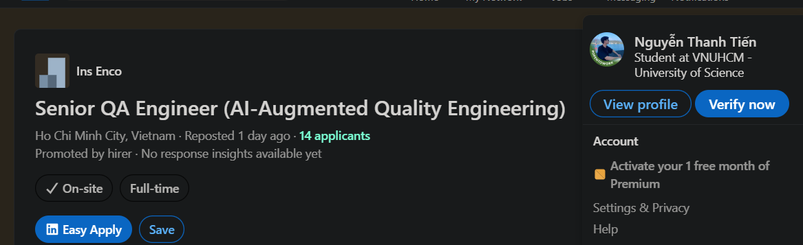

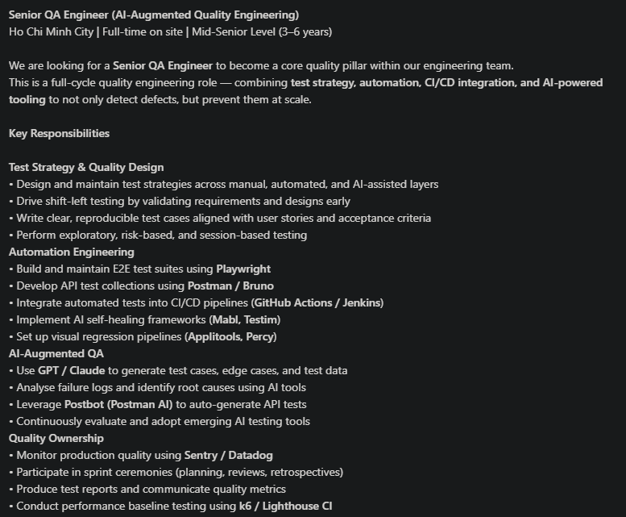

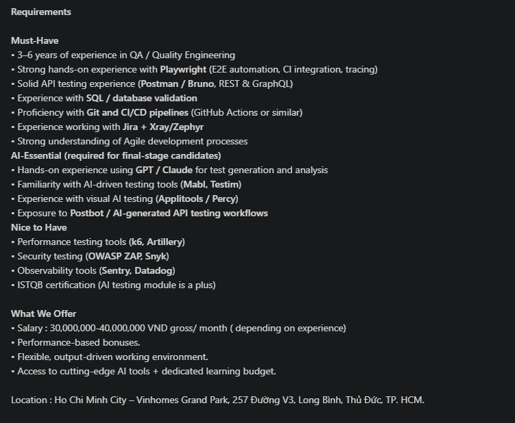

**Tóm tắt mô tả công việc:**
Vị trí Quality Engineering kết hợp kiểm thử thủ công, automation, CI/CD và AI-powered tooling. Công việc gồm xây dựng test strategy, viết test case, kiểm thử E2E bằng Playwright, API testing với Postman/Bruno, tích hợp test vào GitHub Actions/Jenkins và triển khai các công cụ AI/self-healing, visual regression như Mabl, Testim, Applitools, Percy.

**Kỹ năng yêu cầu:**
Yêu cầu kinh nghiệm với Playwright, API testing, REST/GraphQL, SQL, Git, CI/CD, GitHub Actions, Jira. Các công cụ AI và testing như GPT, Claude, Mabl, Testim, Applitools, Percy, Postbot, k6 và Lighthouse CI là lợi thế.

**Phân tích tác động của AI:**
Tin tuyển dụng cho thấy QA/QC đang chuyển sang hướng quality engineering có AI hỗ trợ. AI giúp tạo test case, test data, phân tích lỗi, self-healing test và visual testing, nhưng tester vẫn chịu trách nhiệm chính trong thiết kế chiến lược kiểm thử, đánh giá rủi ro và đảm bảo chất lượng sản phẩm.

---

### Job 05 — QA Engineer (Automation/Manual Testing)

**Công ty:** Ewoosoft Vietnam
**Nền tảng:** ITviec
**Ngày đăng:** 06/05/2026
**Địa điểm:** 19 Duy Tan, Cầu Giấy, Hà Nội
**Lương:** Up to USD 1,500
**Có liên quan AI / LLM / Automation-AI:** Có
**Link:** [Ewoosoft Vietnam - QA Engineer (Automation & Manual Testing, up to USD 1,500) | ITviec](https://itviec.com/it-jobs/qa-engineer-automation-manual-testing-up-to-1500-ewoosoft-vietnam-3137)

**Minh chứng ảnh chụp:**

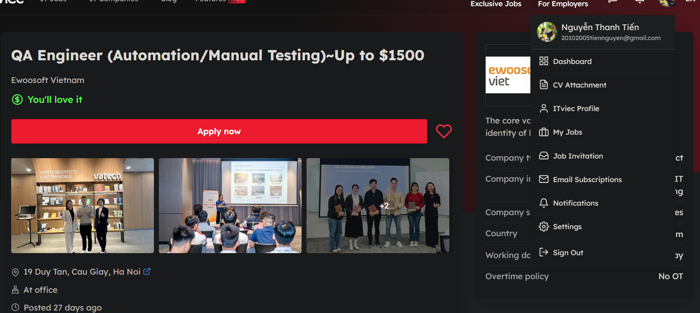

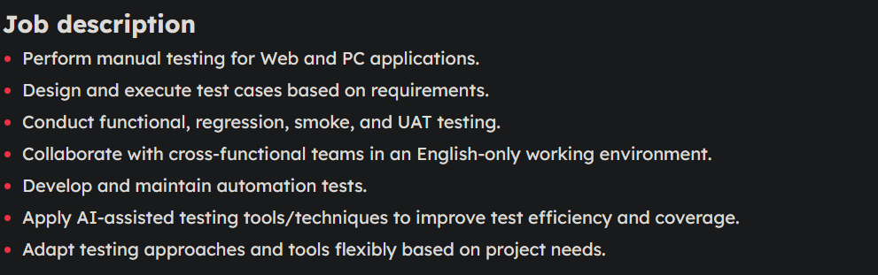

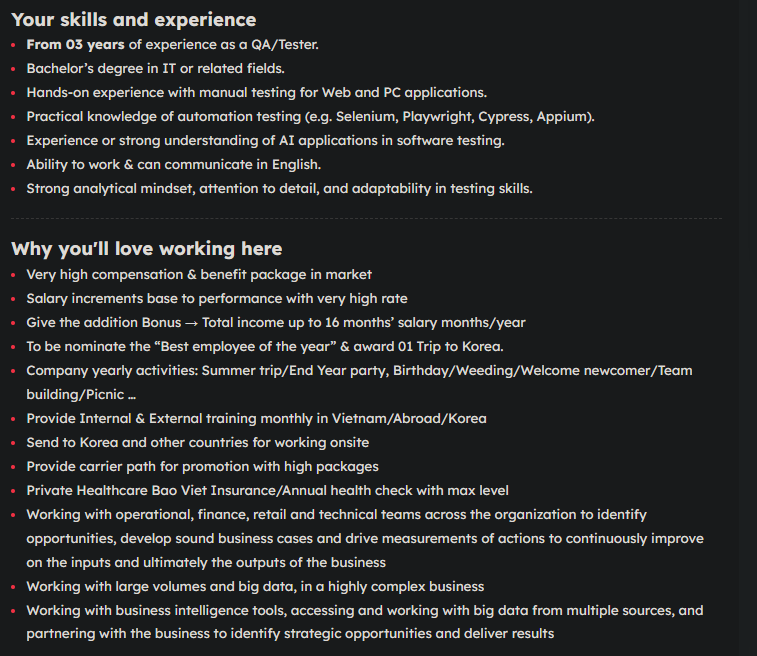

**Tóm tắt mô tả công việc:**
Vị trí QA Engineer phụ trách manual testing cho Web và PC applications, bao gồm thiết kế/thực thi test case, functional testing, regression testing, smoke testing và UAT. Ứng viên cũng phối hợp với các nhóm liên chức năng, duy trì automation tests và áp dụng AI-assisted testing để tăng hiệu quả, độ bao phủ kiểm thử.

**Kỹ năng yêu cầu:**
Manual testing, Web/PC application testing, test case design, functional/regression/smoke/UAT testing, automation testing, Selenium, Playwright, Cypress, Appium, AI-assisted testing và giao tiếp tiếng Anh.

**Phân tích tác động của AI:**
Tin tuyển dụng cho thấy QA/QC đang kết hợp manual testing, automation và AI-assisted testing. AI có thể hỗ trợ tạo test case, tối ưu regression testing và cải thiện độ bao phủ, nhưng tester vẫn chịu trách nhiệm đánh giá yêu cầu, thực thi kiểm thử và xác nhận kết quả cuối cùng.

---

### Job 06 – QC Engineer (Tester/QA QC) for Web

**Công ty:** Evolus/PlanV  
**Nền tảng:** ITviec  
**Ngày đăng:** 18/05/2026
**Địa điểm:** 2nd floor, PHL Building, 109 Cong Hoa Street, Bay Hien, Ho Chi Minh  
**Lương:** Up to USD 1,500  
**Có liên quan AI / LLM / Automation-AI:** Không  
**Link:** [Evolus/PlanV - QC Engineer (Tester/QA QC) for Web, up to USD 1,500 | ITviec](https://itviec.com/it-jobs/qc-engineer-tester-qa-qc-for-web-up-to-1500-evolus-planv-5225)

**Minh chứng ảnh chụp:**

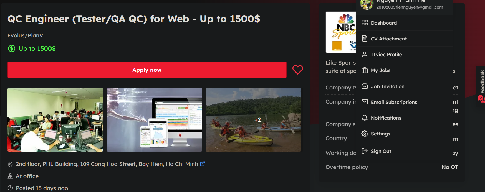

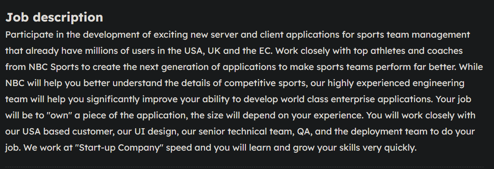

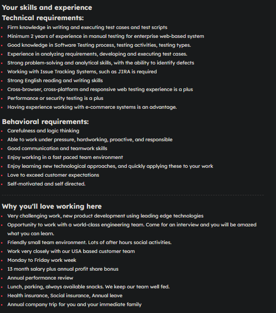
**Tóm tắt mô tả công việc:**
Vị trí QC Engineer tham gia kiểm thử ứng dụng server và client cho hệ thống quản lý đội thể thao có lượng người dùng lớn tại Mỹ, Anh và châu Âu. Công việc bao gồm phối hợp với khách hàng, UI team, technical team, QA và deployment team để đảm bảo chất lượng sản phẩm trong môi trường startup phát triển nhanh.

**Kỹ năng yêu cầu:**
Ứng viên cần tối thiểu 2 năm kinh nghiệm manual testing cho web enterprise, có khả năng phân tích requirement, viết và thực thi test case/test script, hiểu quy trình kiểm thử, sử dụng Jira và đọc viết tiếng Anh tốt. Kinh nghiệm cross-browser, cross-platform, responsive web testing, performance/security testing hoặc e-commerce là lợi thế.

**Phân tích tác động của AI:**
Tin tuyển dụng chủ yếu yêu cầu kỹ năng QA/QC truyền thống như manual testing, phân tích yêu cầu và quản lý lỗi. AI có thể hỗ trợ tạo checklist, gợi ý test case hoặc tóm tắt bug, nhưng tester vẫn cần trực tiếp hiểu sản phẩm, làm việc với khách hàng và xác nhận chất lượng trước khi triển khai.

---

### Job 07 – QA Engineer

**Công ty:** Vietnam Job Listing – Vietnam Jobs & Careers | Recruitment / D.Foundation
**Nền tảng:** LinkedIn
**Ngày đăng:** 1 tháng trước
**Địa điểm:** Thành phố Hồ Chí Minh
**Lương:** USD 1,800–2,000
**Có liên quan AI / LLM / Automation-AI:** Có — liên quan đến Automation Testing và kiểm thử Machine Learning features/workflows
**Link:** [Vietnam Job Listing - QA Engineer (+5 YOE, Hybrid) | LinkedIn](https://www.linkedin.com/jobs/view/4398772040/)

**Minh chứng ảnh chụp:**

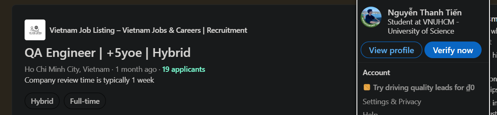

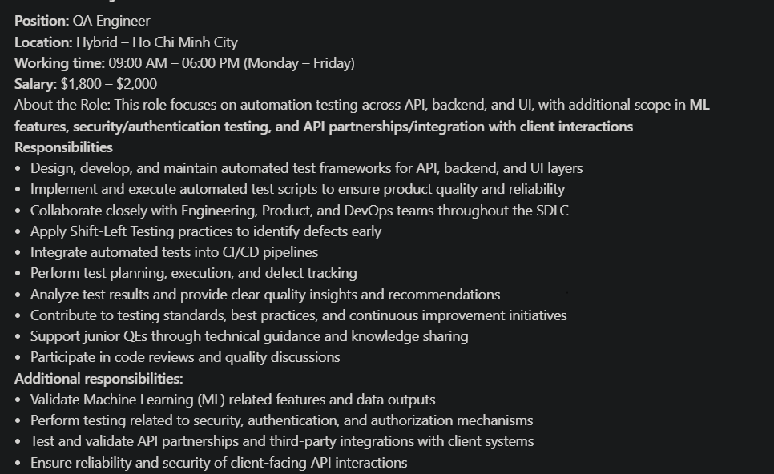

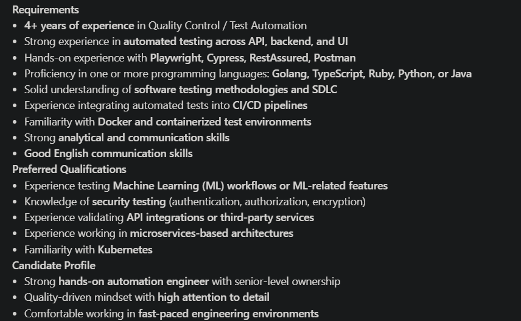

**Tóm tắt mô tả công việc:**
Vị trí QA Engineer tập trung vào automation testing cho API, backend và UI, đồng thời kiểm thử các tính năng liên quan đến Machine Learning, security/authentication và tích hợp API với hệ thống khách hàng. Công việc gồm xây dựng automated test frameworks, viết test scripts, áp dụng Shift-Left Testing, tích hợp test vào CI/CD và phối hợp với Engineering, Product, DevOps trong toàn bộ SDLC.

**Kỹ năng yêu cầu:**
Ứng viên cần từ 4 năm kinh nghiệm QC/Test Automation, mạnh về API, backend và UI automation. Yêu cầu kinh nghiệm với Playwright, Cypress, RestAssured, Postman; biết Golang, TypeScript, Ruby, Python hoặc Java; hiểu SDLC, CI/CD, Docker. Kinh nghiệm ML testing, security testing, microservices, API integrations và Kubernetes là lợi thế.

**Phân tích tác động của AI:**
Tin tuyển dụng cho thấy QA/QC đang mở rộng từ automation truyền thống sang kiểm thử các tính năng AI/ML. Tester cần đánh giá output của ML features, độ tin cậy của API integrations và rủi ro bảo mật. Dù AI/ML làm hệ thống phức tạp hơn, tester vẫn giữ vai trò chính trong phân tích, đánh giá rủi ro và đảm bảo chất lượng sản phẩm.

---

### Job 08 – Tester Onsite Số 1 Giang Văn Minh

**Công ty:** CÔNG TY CỔ PHẦN TECHASIANS
**Nền tảng:** TopCV
**Ngày hạn:** 26/06/2026
**Địa điểm:** Số 1 Giang Văn Minh, Phường Đống Đa, Hà Nội
**Lương:** 18–21 triệu VND
**Có liên quan AI / LLM / Automation-AI:** Không
**Link:** [TECHASIANS - Tester Onsite Số 1 Giang Văn Minh, lương 18–21 triệu | TopCV](https://www.topcv.vn/viec-lam/tester-onsite-so-1-giang-van-minh-luong-18-21-trieu/2046861.html)

**Minh chứng ảnh chụp:**

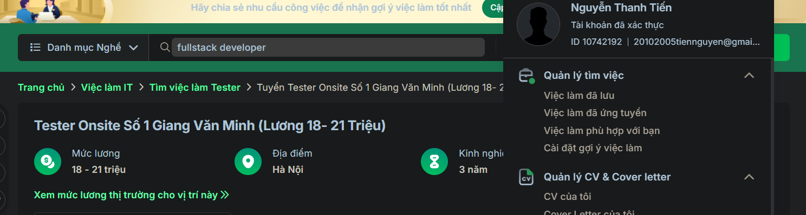

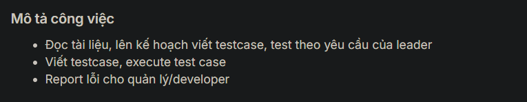

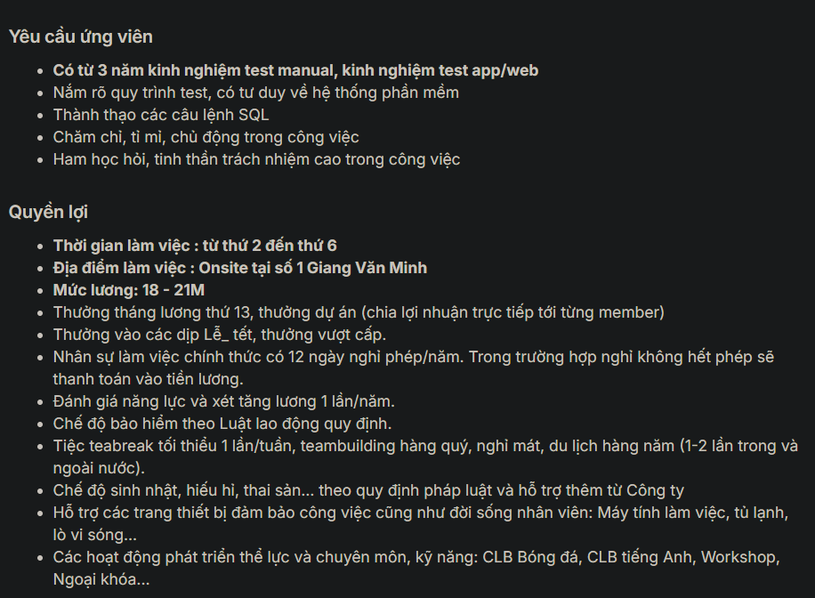

**Tóm tắt mô tả công việc:**  
Vị trí này yêu cầu Manual Tester đọc tài liệu, lên kế hoạch viết test case và thực hiện kiểm thử theo yêu cầu của leader. Công việc chính bao gồm viết test case, execute test case, report lỗi cho quản lý hoặc developer, và phối hợp trong quy trình kiểm thử app/web.

**Kỹ năng yêu cầu:**  
Ứng viên cần có từ 3 năm kinh nghiệm manual testing, có kinh nghiệm test app/web, nắm rõ quy trình kiểm thử và có tư duy về hệ thống phần mềm. Job yêu cầu thành thạo SQL, chăm chỉ, tỉ mỉ, chủ động, ham học hỏi và có tinh thần trách nhiệm cao trong công việc.

**Phân tích tác động của AI:**  
Tin tuyển dụng này cho thấy thị trường vẫn có nhu cầu rõ ràng đối với Manual Tester truyền thống, đặc biệt ở các công việc đọc tài liệu, viết test case, thực thi kiểm thử và báo cáo lỗi. AI có thể hỗ trợ tạo test case nháp, gợi ý checklist hoặc tóm tắt bug report, nhưng việc hiểu yêu cầu, kiểm thử app/web thực tế, phân tích lỗi và giao tiếp với developer vẫn cần tester trực tiếp thực hiện.

---

### Job 09 – Tester (QA/QC) - Lĩnh Vực Tài Chính

**Công ty:** Investingpro Joint Stock Company
**Nền tảng:** TopCV
**Ngày hạn:** 29/06/2026
**Địa điểm:** An Hưng, Phường Hà Đông, Hà Nội
**Lương:** Thỏa thuận, up to 20 triệu VND
**Có liên quan AI / LLM / Automation-AI:** Không
**Link:** [TopCV - Tester (QA/QC) - Lĩnh Vực Tài Chính](https://www.topcv.vn/viec-lam/tester-qa-qc-linh-vuc-tai-chinh/2182580.html)

**Minh chứng ảnh chụp:**

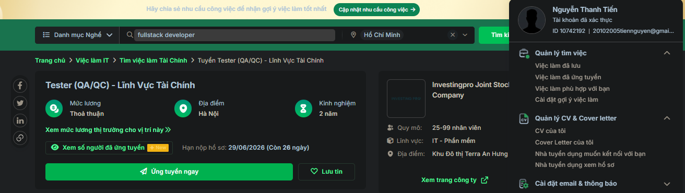

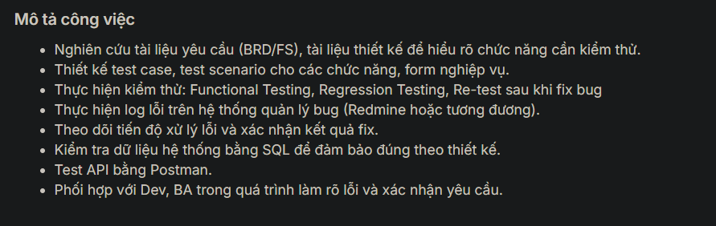

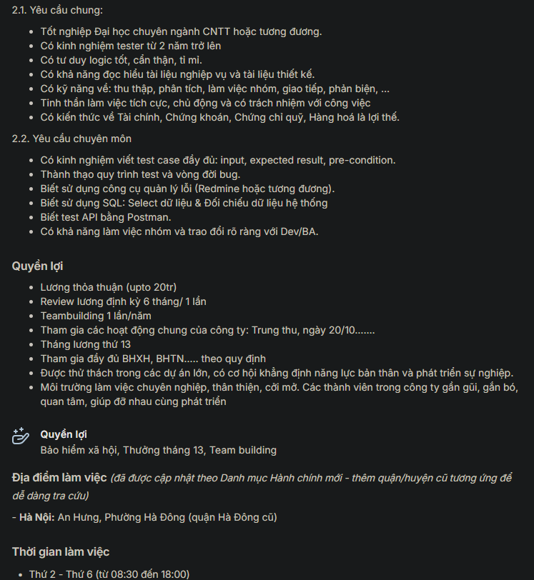

**Tóm tắt mô tả công việc:**
Vị trí Tester QA/QC trong lĩnh vực tài chính, phụ trách đọc hiểu tài liệu BRD/FS, thiết kế test case/test scenario, thực hiện functional testing, regression testing, re-test bug và log lỗi trên Redmine hoặc công cụ tương đương. Tester cũng cần kiểm tra dữ liệu bằng SQL, test API bằng Postman và phối hợp với Dev/BA để làm rõ yêu cầu, xác nhận lỗi.

**Kỹ năng yêu cầu:**
Ứng viên cần từ 2 năm kinh nghiệm tester, tốt nghiệp CNTT hoặc tương đương, có tư duy logic, cẩn thận và kỹ năng phân tích tốt. Yêu cầu biết viết test case đầy đủ, hiểu quy trình test và vòng đời bug, sử dụng Redmine, SQL, Postman. Kiến thức tài chính, chứng khoán, chứng chỉ quỹ hoặc hàng hóa là lợi thế.

**Phân tích tác động của AI:**
Tin tuyển dụng không đề cập trực tiếp đến AI, nhưng AI có thể hỗ trợ tester tóm tắt tài liệu BRD/FS, gợi ý test scenario, tạo test case nháp, sinh test data và viết bug report. Tuy nhiên, trong lĩnh vực tài chính, tester vẫn cần trực tiếp hiểu nghiệp vụ, kiểm tra dữ liệu bằng SQL, xác nhận logic hệ thống và chịu trách nhiệm cuối cùng về chất lượng.

---

### Job 10 – Manual Tester (Leader)

**Công ty:** CÔNG TY CỔ PHẦN CÔNG NGHỆ ALPHAWAY  
**Nền tảng:** TopCV  
**Ngày hạn:** 17/06/2026  
**Địa điểm:** Hồ Chí Minh  
**Lương:** 25–35 triệu VND  
**Có liên quan AI / LLM / Automation-AI:** Không  
**Link:** [TopCV - Manual Tester (Leader)](https://www.topcv.vn/viec-lam/manual-tester-leader/2164284.html)
**Minh chứng ảnh chụp:**

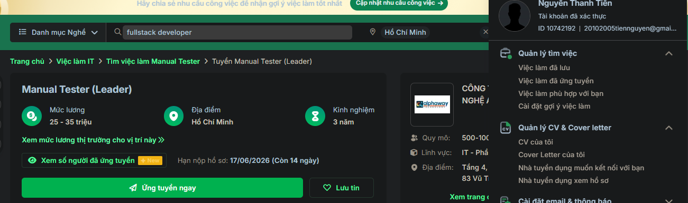

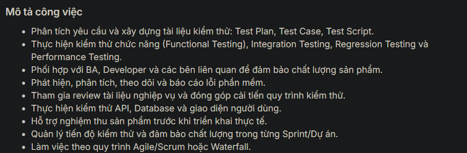

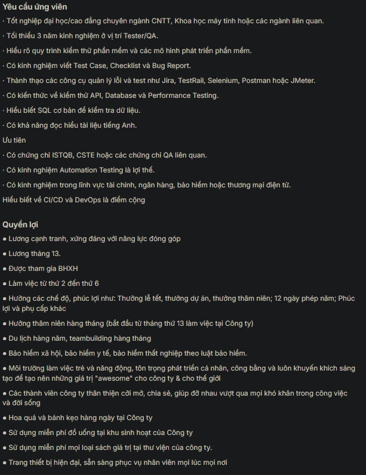

**Tóm tắt mô tả công việc:**
Vị trí Manual Tester Leader phụ trách phân tích yêu cầu, xây dựng Test Plan, Test Case, Test Script và thực hiện functional, integration, regression, performance testing. Công việc gồm kiểm thử API, database, UI, quản lý tiến độ test theo Sprint/dự án, theo dõi lỗi và phối hợp với BA, Developer để đảm bảo chất lượng sản phẩm trước khi nghiệm thu.

**Kỹ năng yêu cầu:**
Ứng viên cần tối thiểu 3 năm kinh nghiệm Tester/QA, hiểu quy trình kiểm thử và mô hình Agile/Scrum hoặc Waterfall. Yêu cầu biết viết Test Case, Checklist, Bug Report; sử dụng Jira, TestRail, Selenium, Postman hoặc JMeter; có kiến thức API testing, database testing, performance testing, SQL cơ bản và đọc hiểu tiếng Anh. ISTQB/CSTE, Automation Testing, CI/CD hoặc kinh nghiệm tài chính/ngân hàng là lợi thế.

**Phân tích tác động của AI:**
Tin tuyển dụng không đề cập trực tiếp đến AI, nhưng AI có thể hỗ trợ tạo checklist, phân tích requirement, gợi ý test case, sinh test script cơ bản, đọc log lỗi và viết báo cáo test. Tuy nhiên, Tester Leader vẫn cần trực tiếp quản lý tiến độ, đánh giá rủi ro, quyết định phạm vi regression và chịu trách nhiệm cuối cùng về chất lượng sản phẩm.
